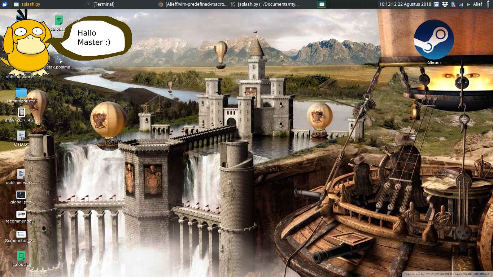

# Splash Displayer

Show image in Linux Desktop that use Xorg as display manager

## Feature : 
1. can load png with transparancy
2. transparent background color

## Usage : 
1. Change image path according to your system
2. execute 
    `python splash.py <your_image_path>`
3. result example : 

## Installation :

1. Install python
2. make sure you can import following python library : gobject, pango, pygtk, gtk, cairo, gobject

## License : 
GNU GPL

